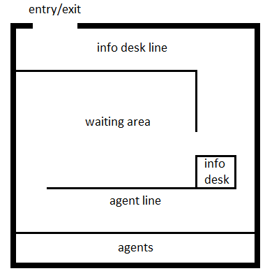

Project #2:  Threads

I.  Project Organization

This project will study the coordination of multiple threads using semaphores.  

You should do the following pieces to complete your project.  Each piece is explained below:

•	Design	40 points
•	Code	25 points
•	Output	25 points
•	Summary	10 points

Design

    The design should consist of two things:  (1) a list of every semaphore, its purpose, and its initial value, and (2) pseudocode for each function.  The pseudocode should be similar to the pseudocode shown in the textbook for the barbershop problem.  Every wait and signal call must be included in the pseudocode.  

Code

    Your code should be nicely formatted with plenty of comments.  The code should be easy to read, properly indented, employ good naming standards, good structure, and should correctly implement the design.  Your code should match your pseudocode.   

Output

     Output will be graded by running your program.  

Summary

     The summary section should discuss your simulation, any difficulties encountered, what was learned, and results.  It should be at least one page in length.
 
II.  Project Description

Language/Platform

This project must target a Unix platform and execute properly on our cs1 Linux server.
The project must be written in C, C++, or Java.
If using C or C++, you must use POSIX pthreads and semaphores.
If using Java, you must use Java Threads and Java Semaphores (java.util.concurrent.Semaphore).  
You should not use the “synchronized” keyword in Java.
You should not use any Java classes that have built-in mutual exclusion.
Any mechanisms for thread coordination other than the semaphore are not allowed.

Department of Motor Vehicles Simulation

This project will simulate operations at the Department of Motor Vehicles for customers renewing their driver’s license.  This project is similar to the “barbershop” example in the textbook.  

The threads to be used are as follows:

Customer
1)	20 customers (1 thread each) all created at the start of the simulation.
2)	Waits in line at Information Desk to get a number.
3)	Waits in waiting area until number is called.
4)	Waits in line for agent.
5)	Works with agent to complete driver’s license application.
6)	Exits

Information Desk
1)	1 thread created at the beginning.
2)	Assigns a unique number sequentially starting at 1 to each customer.

Announcer
1)	1 thread created at the beginning.
2)	Tries to keep agent line filled with 4 people.

Agent
1)	2 threads created at the beginning.
2)	Asks customer to take eye exam and photo.
3)	Provides customer with temporary license.

Main
1)	Creates and joins all customer threads.  Customer threads may be joined in creation order.
2)	When last customer has exited, ends the simulation.
 
Other rules:
1)	Each activity of each thread should be printed with identification (e.g., customer 1).
2)	All mutual exclusion and coordination must be achieved with semaphores.  
3)	A thread may not use sleeping as a means of coordination.  
4)	Busy waiting (polling) is not allowed. 
5)	Mutual exclusion should be kept to a minimum to allow the most concurrency.
6)	The semaphore value may not obtained and used as a basis for program logic.
7)	Each customer thread should print when it is created and when it is joined.
8)	All activities of a thread should only be output by that thread.
Output:

Your project’s output should match the wording and steps of the sample output, although the order may vary. 

Sample output for 2 agents and 4 customers:

Information desk created
Announcer created
Agent 0 created
Agent 1 created
Customer 1 created, enters DMV
Customer 1 gets number 0, enters waiting room
Customer 0 created, enters DMV
Announcer calls number 0
Customer 2 created, enters DMV
Customer 0 gets number 1, enters waiting room
Customer 1 moves to agent line
Customer 2 gets number 2, enters waiting room
Announcer calls number 1
Announcer calls number 2
Customer 0 moves to agent line
Customer 2 moves to agent line
Agent 1 is serving customer 0
Agent 0 is serving customer 1
Customer 3 created, enters DMV
Customer 1 is being served by agent 0
Agent 0 asks customer 1 to take photo and eye exam
Customer 0 is being served by agent 1
Customer 3 gets number 3, enters waiting room
Agent 1 asks customer 0 to take photo and eye exam
Customer 0 completes photo and eye exam for agent 1
Agent 1 gives license to customer 0
Announcer calls number 3
Customer 0 gets license and departs
Customer 0 was joined
Agent 1 is serving customer 2
Customer 1 completes photo and eye exam for agent 0
Customer 3 moves to agent line
Customer 2 is being served by agent 1
Agent 0 gives license to customer 1
Agent 1 asks customer 2 to take photo and eye exam
Customer 1 gets license and departs
Customer 2 completes photo and eye exam for agent 1
Customer 1 was joined
Agent 0 is serving customer 3
Agent 1 gives license to customer 2
Customer 2 gets license and departs
Customer 2 was joined
Customer 3 is being served by agent 0
Agent 0 asks customer 3 to take photo and eye exam
Customer 3 completes photo and eye exam for agent 0
Agent 0 gives license to customer 3
Customer 3 gets license and departs
Customer 3 was joined
Done

The DMV is illustrated in the diagram shown below.  

III. Project Guidelines

Submitting

Submit your project on eLearning.  Include in your submission the following files:

1)	‘design.xxx’ where xxx is doc, docx, or pdf.
2)	‘summary.xxx’ where xxx is doc, docx, or pdf.
3)	‘project2.c’, ‘project2.cpp’, or ‘Project2.java’ along with any other source files.
4)	‘readme.txt’ containing:
a.	the complete command line used to compile your program
b.	the complete command line used to run your program
c.	any other details the TA should know 

Partial or Missing Submissions

It is your responsibility to upload all of the right files on time.  It is recommended that you double-check the files you upload to make sure they are the right ones.  

Academic Honesty

This is an individual project.  All work must be your own.  Comparison software may be used to compare the work of all students.  Similar work will be reported to the Office of Judicial Affairs for investigation.  

Grading

The written portions will be graded subjectively based on completeness and quality.  The code will be graded based on points allocated for each key part of the processing as determined by the instructor.  The output will be graded based on expected results.

 
Resources

The web has many articles on threads and there are books available on threads.  The course website also contains example source code.

